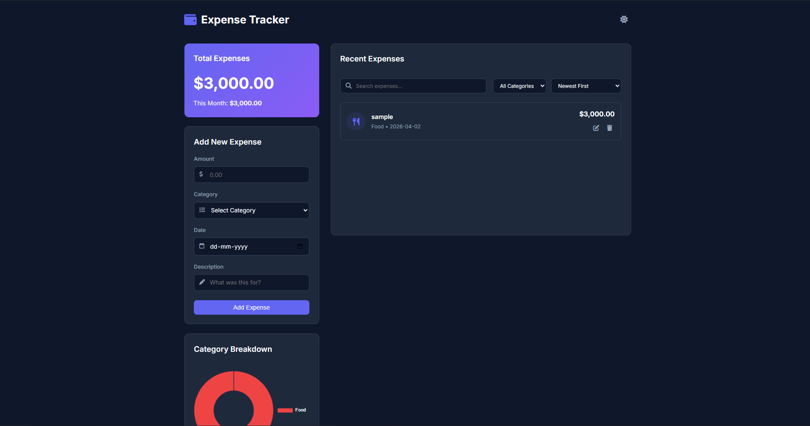

<div align="center">

# 💰 Smart Expense Tracker
  
A sleek, modern, and responsive web application designed to help you seamlessly track, manage, and visualize your daily expenses. Built with Vanilla JavaScript, beautifully styled with Custom CSS, and complete with live Chart.js visualizations.
  
[](https://expensetrackerappbyjiya.netlify.app/)
[](https://expensetrackerappbyjiya.netlify.app/)
[](https://developer.mozilla.org/en-US/docs/Web/JavaScript)
[](https://developer.mozilla.org/en-US/docs/Glossary/HTML5)
[](https://developer.mozilla.org/en-US/docs/Web/CSS)

</div>

---

## 📸 Application Preview

<div align="center">
  
  <br>
  <em>A clean, responsive dashboard allowing robust expense management</em>
</div>

---

## 🚀 Live Demo

Check out the live deployment of the application here:  
👉 **[Smart Expense Tracker App](https://expensetrackerappbyjiya.netlify.app/)**

---

## ✨ Core Features

- **Categorized Expenses:** Quickly assign expenses to built-in categories (`Food`, `Travel`, `Shopping`, `Bills`, `Others`) for easier tracking.
- **Full CRUD Functionality:** Easily Add, Edit, and Delete your expense items on the fly.
- **Dynamic Dashboard & Charts:** View your spending distributions interactively via an integrated **Chart.js** Doughnut Chart alongside real-time monthly and absolute totals.
- **Advanced Filtering & Sorting:** Sort your expenditures by latest/oldest Date or highest/lowest amounts. Instantly filter the list by Category or perform text-based searches.
- **Data Persistence:** All transactions and theme selections are securely saved to your browser's `localStorage` — no data lost on page refresh!
- **Dark Mode Support:** A beautifully designed Light/Dark mode toggle caching your visual preference.
- **Mobile Responsive Design:** An adaptable CSS Grid/Flexbox architecture ensuring the app looks flawless on screens ranging from large desktop monitors to mobile phones.

---

## 🛠️ Built With

This project avoids heavy frameworks to demonstrate foundational, robust performance:

* **HTML5:** Semantic architecture
* **CSS3:** Custom properties (CSS variables) for robust theming, Flexbox/Grid for layout, and modern glassmorphism UI touches.
* **Vanilla JavaScript (ES6+):** Handling DOM Manipulations, State Management, and LocalStorage logic natively.
* **Chart.js:** For rendering lightweight, interactive data visualizations.
* **FontAwesome:** Scalable vector icons.

---

## 💻 Getting Started Locally

To run this project on your local machine, simply follow these steps:

### Prerequisites

You need a web browser (Chrome, Firefox, Edge, Safari, etc.). No Node.js or `npm` installation is required!

### Installation

1. **Clone the repository:**
   ```bash
   git clone https://github.com/jiyakrishnaoffical/Expense_tracker.git
   ```
2. **Navigate to the directory:**
   ```bash
   cd Expense_tracker
   ```
3. **Launch the Application:**
   Since it runs purely on Vanilla front-end technologies, you can just open the `index.html` file in your preferred web browser. Alternatively, if you have VS Code installed, you can use the **Live Server** extension for a localized development environment.

---

## 📂 Project Structure

```text
Expense_tracker/
├── Img/
│   └── 12.png          # UI Preview Screenshot
├── index.html          # Core HTML scaffolding
├── style.css           # Styling logic (Themes, Layouts, Mobile Responsiveness)
├── script.js           # CRUD Operations, LocalStorage, Charting and Filtering Logic
└── README.md           # Documentation
```

---

## 💡 Key Learnings

Building this application cemented best practices in:
- Modular, state-driven vanilla JavaScript design architecture.
- Harnessing the Browser `LocalStorage` API to ensure decoupled data persistence.
- Manipulating real-time inputs using JS array methods (`filter()`, `reduce()`, `map()`, `sort()`).
- Utilizing custom CSS properties for dynamic theming (Dark/Light mode).

---

<div align="center">
  <p>Built with ❤️ by Jiya</p>
</div>
